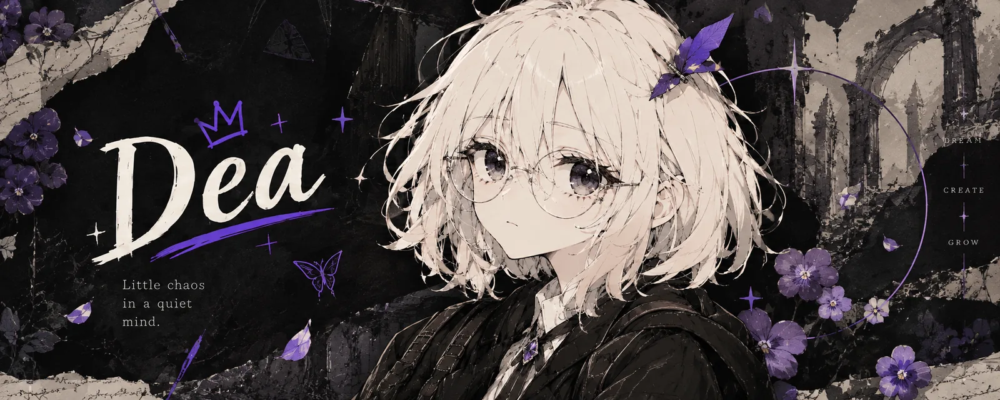
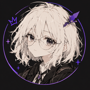

  

  <samp>COMPUTER ENGINEERING · ÓBUDA UNIVERSITY · BIOTECH RESEARCH LAB · BUDAPEST</samp> 
  <samp><a href="https://www.linkedin.com/in/nagy-istv%C3%A1n-bence-54b2681b0/">LINKEDIN ↗</a> · <a href="https://deawebdesign.netlify.app/">PORTFOLIO ↗</a></samp>

### <samp>01 — WHAT I BUILD</samp>

Research software, mostly. I write the tools that sit between a person in a VR headset
and the data a lab can actually publish: acquisition, sync, robotics bridges, analysis.
On the side I build the things I wish existed for free.

I like offline-first systems, strict contracts between processes, and taking a problem
apart before reaching for a solution.

### <samp>02 — SELECTED WORK</samp>

<table>
  <tr>
    <td><samp>01</samp></td>
    <td><b>VRTelemetry</b> <samp>· PRIVATE</samp> <samp>PYTHON · TYPESCRIPT · ELECTRON</samp></td>
    <td>A research instrument for VR studies. Records eye tracking, pose, physiology and hardware state to Parquet at headset rate, scores SSQ / NASA-TLX, and syncs to a central hub — queueing locally when the lab network is gone. Extended through out-of-process plugins for BLE biosensors, medical analytics and a ROS 2 / Unity bridge.</td>
  </tr>
  <tr>
    <td><samp>02</samp></td>
    <td><b>vr-robot-bridge</b> <samp>· PRIVATE</samp> <samp>C# · PYTHON · ROS · UNITY</samp></td>
    <td>Streams live HMD and controller poses into a Gazebo / MoveIt robot hand and mirrors it in a Unity XR scene. OpenXR → REP-103 → Unity coordinate conversion, verified by tests; ROS runs in WSL2.</td>
  </tr>
  <tr>
    <td><samp>03</samp></td>
    <td><a href="https://github.com/Deatron01/Project-Mimir"><b>Project-Mimir</b></a> <samp>FASTAPI · NODE · POSTGRES · RAG</samp></td>
    <td>Microservices that turn PDFs and DOCX files into exam questions. Semantic chunking, RAG over a vector store, JSON-schema guards against hallucination, a <code>SKIP LOCKED</code> worker pool, and hand-built Moodle XML / PDF export.</td>
  </tr>
  <tr>
    <td><samp>04</samp></td>
    <td><a href="https://github.com/Deatron01/AIWorkGroup"><b>AIWorkGroup</b></a> <samp>PYTHON · DOCKER · OLLAMA</samp></td>
    <td>A fully local multi-agent software foundry. Boss, designer, worker, tester and integrator agents coordinate over an event bus with a DAG tracker, human-in-the-loop checkpoints and a live dashboard — all on local models.</td>
  </tr>
  <tr>
    <td><samp>05</samp></td>
    <td><a href="https://github.com/Deatron01/OpenRaConverterModul"><b>OpenRaConverterModul</b></a> <samp>C# · ASP.NET CORE · DOCKER</samp></td>
    <td>Code synthesis for the OpenRA RTS engine: an API that turns unit, weapon and trait definitions into decision trees and generates the matching C# trait classes and YAML rules. Part of the OE_Lagrange project, alongside an <a href="https://github.com/Deatron01/OE_Lagrange_Side_Projects">entity-creator service, SQL schemas and a PowerShell environment manager</a>.</td>
  </tr>
  <tr>
    <td><samp>06</samp></td>
    <td><a href="https://github.com/Deatron01/FreeTex"><b>FreeTex</b></a> <samp>JAVASCRIPT · CODEMIRROR 6 · ELECTRON</samp></td>
    <td>An Overleaf-style LaTeX editor that runs in the browser or as a desktop app with its own compile server. Local-first projects, BibTeX-aware autocompletion, zip import / export.</td>
  </tr>
  <tr>
    <td><samp>07</samp></td>
    <td><a href="https://github.com/Deatron01/Photoshop"><b>Photoshop</b></a> <samp>C# · .NET 8 · WPF</samp></td>
    <td>An image editor for an image-processing course: filters and analytics split into separate core and analytics libraries behind an MVVM WPF front end.</td>
  </tr>
  <tr>
    <td><samp>08</samp></td>
    <td><a href="https://github.com/Deatron01/ZizgoKereso"><b>ZizgoKereso</b></a> <samp>PYTHON · OPENCV · PYQT6 · C# · BLENDER</samp></td>
    <td>"Where's Zizgő?" — finds a figure in a busy photo. Blender renders the reference set across camera angles and lighting, then HSV colour-masked template matching locates the best hit, with a live heatmap view. Built twice: PyQt6 + OpenCV and C# WinForms.</td>
  </tr>
  <tr>
    <td><samp>09</samp></td>
    <td><a href="https://github.com/Deatron01/AdBlocker"><b>AdBlocker</b></a> <samp>JAVASCRIPT · MANIFEST V3</samp></td>
    <td>A Chrome extension on <code>declarativeNetRequest</code> with popup and redirect guards and on-the-fly domain learning. Collects nothing.</td>
  </tr>
  <tr>
    <td><samp>10</samp></td>
    <td><a href="https://github.com/Deatron01/PhoneMirror"><b>PhoneMirror</b></a> <samp>PYTHON · WEB</samp></td>
    <td>Free, self-hosted phone mirroring that works on any device.</td>
  </tr>
</table>

<samp>MORE — SMALLER PROJECTS &amp; COURSEWORK</samp>

 
<table>
  <tr><td><a href="https://github.com/Deatron01/Gen_AI_DP3HYC">Gen_AI_DP3HYC</a></td><td><samp>PYTORCH LIGHTNING</samp></td><td>A DCGAN that learns to generate flower images.</td></tr>
  <tr><td><a href="https://github.com/Deatron01/Szakszigo-Gyakorlo">Szakszigo-Gyakorlo</a></td><td><samp>C#</samp></td><td>Every classic programming theorem implemented and commented, for exam practice.</td></tr>
  <tr><td><a href="https://github.com/Deatron01/Erika-konyhaja">Erika-konyhaja</a></td><td><samp>VITE · TAILWIND</samp></td><td>A live website for a small kitchen business.</td></tr>
  <tr><td><a href="https://github.com/Deatron01/NKVGM1EMNF-GM1_LA_AT_Eng">NKVGM1EMNF-GM1_LA_AT_Eng</a></td><td><samp>COURSEWORK</samp></td><td>Generative AI.</td></tr>
  <tr><td><a href="https://github.com/Deatron01/NIXSG1LBNE-SZTGUI_LA_02">NIXSG1LBNE-SZTGUI_LA_02</a></td><td><samp>COURSEWORK</samp></td><td>Software technology &amp; GUI design.</td></tr>
  <tr><td><a href="https://github.com/Deatron01/NKXBATHBNE-BevAdTud_EA_MI1">NKXBATHBNE-BevAdTud_EA_MI1</a></td><td><samp>COURSEWORK</samp></td><td>Introduction to data science.</td></tr>
  <tr><td><a href="https://github.com/Deatron01/Cpluszplusz-NSWCPVHBNF">Cpluszplusz-NSWCPVHBNF</a></td><td><samp>COURSEWORK</samp></td><td>C++.</td></tr>
</table>

### <samp>03 — STACK</samp>

<table>
  <tr><td><samp>LANGUAGES</samp></td><td><picture><source media="(prefers-color-scheme: light)" srcset="https://skillicons.dev/icons?i=python,cs,ts,js,cpp,php,latex&perline=10&theme=light" /></picture></td></tr>
  <tr><td><samp>SYSTEMS</samp></td><td><picture><source media="(prefers-color-scheme: light)" srcset="https://skillicons.dev/icons?i=ros,unity,godot,blender,electron,fastapi,nodejs&perline=10&theme=light" /></picture> + OpenXR</td></tr>
  <tr><td><samp>DATA</samp></td><td><picture><source media="(prefers-color-scheme: light)" srcset="https://skillicons.dev/icons?i=postgres&perline=10&theme=light" /></picture> + Parquet · MinIO · vector search / RAG · local LLMs (Ollama)</td></tr>
  <tr><td><samp>TOOLING</samp></td><td><picture><source media="(prefers-color-scheme: light)" srcset="https://skillicons.dev/icons?i=git,docker,linux,githubactions,vscode&perline=10&theme=light" /></picture> + WSL2</td></tr>
</table>

### <samp>04 — ACTIVITY</samp>

  <picture>
    <source media="(prefers-color-scheme: dark)" srcset="https://raw.githubusercontent.com/Deatron01/Deatron01/output/snake-dark.svg" />
    <source media="(prefers-color-scheme: light)" srcset="https://raw.githubusercontent.com/Deatron01/Deatron01/output/snake-light.svg" />
    
  </picture>

   
  <i>Little chaos in a quiet mind.</i> 
  <samp>DESIGN WORK LIVES AT <a href="https://deawebdesign.netlify.app/">DEAWEBDESIGN.NETLIFY.APP</a></samp>

